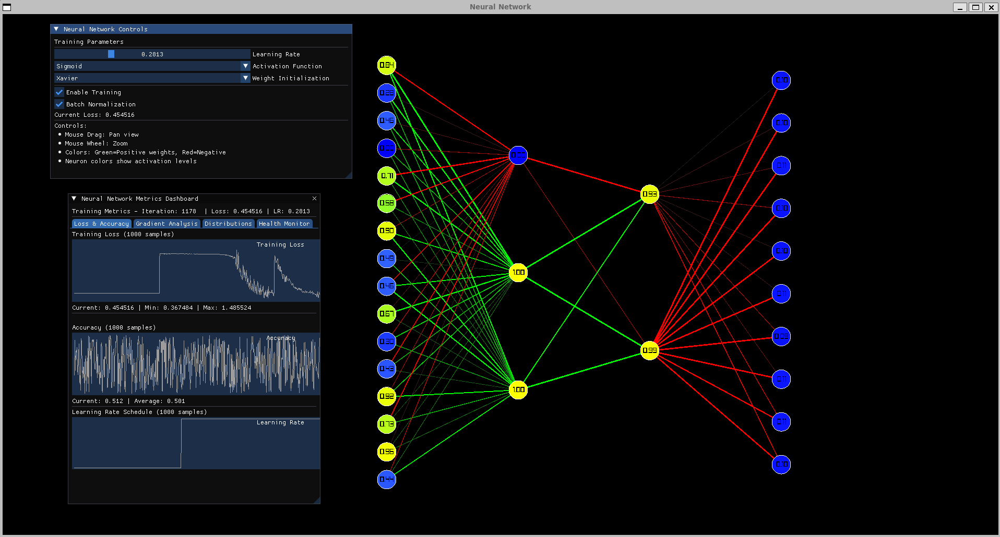

# learn-neural-network
A place for me to learn neural network using raylib for visualisation.

### Example display of the NN
`NeuralNetwork nn(5, std::vector<int>{2, 3, 2, 13, 1})`
<p align="center">

</p>

## Build steps
```
mkdir .build && cd .build
cmake -DCMAKE_BUILD_TYPE=Release -DCMAKE_POLICY_VERSION_MINIMUM=3.5 ..
cmake --build .
```

## Run app
```
cd .build
./neural-network
```